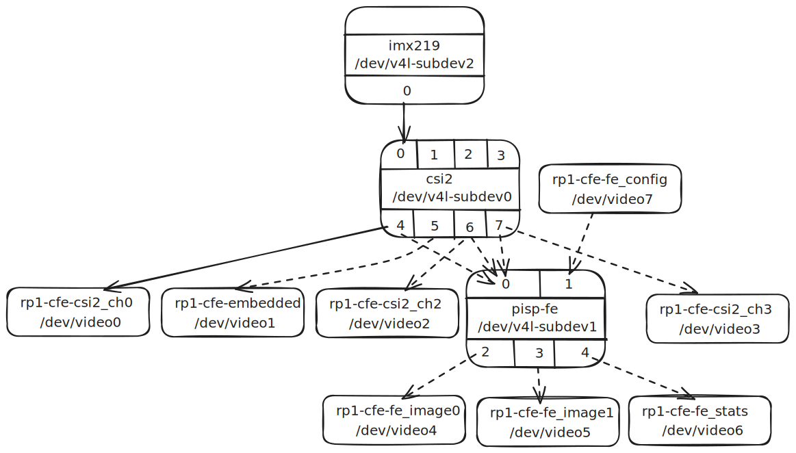
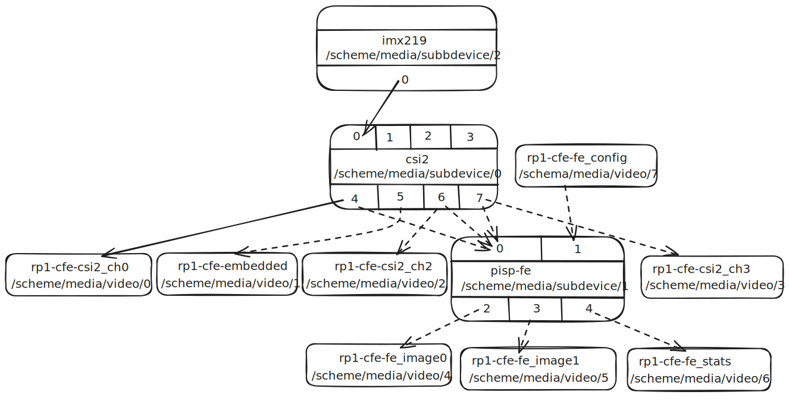

- Feature Name: Redox Media Platform (part I: Entities)
- Start Date: 2025-06-02
- RFC PR: (leave this empty)
- Redox Issue: (leave this empty)

# Summary
[summary]: #summary

This document opens new chapter in Redox OS in relation to lying foundations for adding support for cameras or other video grabbing devices.
The document is a starting point to build into Redox features inspired by [Media subsystem kernel internal API][media-kernel-api] & [Linux Media Infrastructure userspace API][media-infra-us-api].

Work on this topic started under the name _Video for Redox_, abbreviated _V4R_, addressing the whole video support in Redox. But original ideas didn't survive feasibility test based on another round of Linux API review. This is a complex problem if flexibility is to be retained.

# Detailed design
[design]: #detailed-design

This is the bulk of the RFC. Explain the design in enough detail for somebody familiar
with the language to understand, and for somebody familiar with the compiler to implement.
This should get into specifics and corner-cases, and include examples of how the feature is used.

## Nomenclature

Media Entity
: A graph node representing an element in the video processing pipeline, usually represented by a subdevice.
: On Linux each graph is accessible via one of `/dev/media*` kernel devices, entities can be enumerated by `ioctl()` calls.

Subdevice
: Instance of a driver responsible for a stage in the video processing pipeline, usually represent piece of hardware peripheral or its configurable and controllable subsystem.
: On Linux each subdevice is accessible via one of `/dev/v4l-subdevice*` which exact name is obtained from media entities enumeration.

Media Pad
: Each subdevice is exposed via numbered media pads, were each can be either a sink or a source. Links between media pads are provided by enumeration of media entities.

Sink
: A sink is a type of the media pad that acts as one of logical inputs of a subdevice; it can be either routable in a separate hardware or only represents configurable bus input of a hardware peripheral subsystem (including firmware, e.g. ISP).

Source
: A source is a type of the media pad that acts as one of logical outputs of a subdevice; it can be either (in)active output bus in separate hardware or configurable bus output of a hardware peripheral subsystem (including firmware, e.g. ISP).

Video Endpoint (TODO: Media Endpoint?)
: Software device for applications to bind to for obtaining or publishing video frames data (in exceptional case non-video metadata).
: On Linux each kernel video device (endpoint) is accessible via one of `/dev/video*` were each one is linked with a source or a sink of one subdevice.

Stream
: To support some hardware dealing with multiplexed data streams (e.g. MIPI CSI-2) that are transferred on the same hardware bus, but are identified virtually. 
: This is very late addition to the Linux kernel and widely adopted examples of these don't exist at the time of writing of this document.

## Example diagrams
<!-- TODO: put them here or move at the end? -->

### Linux on Raspberry Pi 5 example



### Proposed structure on Redox

This is example of visual representation of a single graph from `/scheme/media/graph/` directory:


## Foundational schemes

The whole subsystem - with details designed in further RFCs - would be founded on two distinctive schemes:

* `/scheme/media` - provides access to media pipelines which control how entities are linked together (via sources and sinks) to provide means for below (one per single graph)
* `/scheme/media/graph/*` - each non-negative number represents a single graph of media entities
* `/scheme/media/subdevice/*` - exposes configuration and controls of individual instances bound with media entities; apart controls, devices are free to expose own APIs here, however, are bound to use entities properly
* `/scheme/media/<device>/*` - exposes data I/O and controls of each endpoint bound to a final source or a initial sink of the media entity; composite drivers which do not expose subdevices may be bound here (e.g. USB cameras) <!-- should we separate video and audio? -->

Linux equivalents for `/scheme/media/<device>/*` are `/dev/video*` (or [other device][media-types]) which you `open()` or `mmap()` and use `ioctl()` to start and stop streaming.

Linux subdevices are exposed as `/dev/v4l-subdev*` (these are intermediate elements of the video pipeline), and media entities are controlled via `/dev/media*`; both heavily rely on `ioctl()` calls for userspace API.

## Media Entity Relationships

Each entry on the `/scheme/media/graph/*` is a numbered directory with at least two files in it:
* `requests` - allows queuing of requests to modify topology and setting on a per-frame basis (out of scope of this document)
* `topology` - access to the entity topology API - entities and their pads with links (contrary to Linux this would address streams directly if supported by the subdevice)

Topologies are represented by structures returning lists of entities, with their pads (with roles and streams if available) and links between them (serialized by the driver).

```rust
struct Pad {
    id: u32,
    direction: ..., 
    connector: bool, // TODO: the flag is must_connect
}

struct Interface {
    id: u32,
    if_type: ..., // the device type this interface is for
    device: ...,  // (sub)device acting as this en
}

struct Link {
    id:        u32,
    source_id: u32, // start of an arrow on the graph, unique ID of the pad or the interface
    sink_id:   u32, // end of an arrow on the graph, unique ID of the pad or the interface
    enabled:   bool, // only one link per sink can be enabled
    immutable: bool, // no runtime modifications allows (usually result of hardware design or device tree)
    dynamic:   bool,
    kind:      ..., // data, interface or ancillary
    
}

struct Entity {
    id:       u32,
    driver:   OsString, // name of the driver implementing the entity
    pads:     Vec<Pad>, // pads exposed for linking
    function: ...,      // function/role of the entity, eg. camera sensor, TV tuner, video scaler, audio mixer, etc.
    kind:     ...,      // default or connector
}

struct Topology {
    topology_version: u64,
    entities:         Vec<Entity>,
    interfaces:       Vec<Interface>,
    links:            Vec<Links>.
}
```

User's requests are represented by following structures (deserialized by the media topology driver):
```rust
enum LinkRequest {
    IdPair { source_id: u32, sink_id: u32, enabled: bool },
    PadIndex { source_entity_idx: u32, souce_pad_idx: u32, dest_entity_idx: u32, sink_pad_idx: u32, enabled: bool }
}

struct LinkStateRequest {
    link_id: u32,
    enabled: bool
}
```

Media (sub)device driver's requests are represented by following structures (deserialized by the media topology driver):
```rust
struct Register {
    driver_name: OsString,
    pads:        Vec<Pad>,
    ... // TODO: we need mechanism for this framework to notify bound drivers, kind of callbacks about topology changes
}
```

# Drawbacks
[drawbacks]: #drawbacks

* Approval and implementation means starting a very long painful journey of slowly building up details of a working video/media subsystem.

# Alternatives
[alternatives]: #alternatives

What other designs have been considered? What is the impact of not doing this?

* Create simple scheme for video related devices only and leave relationship between them only into userspace's libraries.
  \
  This method is though for DMA transfers between related peripherals or hardware links not existing in the software.

* Different structure:


# Unresolved questions
[unresolved]: #unresolved-questions

What parts of the design are still TBD?

- CIS-2 camera sensor drivers need access to I²C
- What are actual API calls to elements in these scheme?
- Where space to map streams if supported?


[media-kernel-api]: https://linuxtv.org/downloads/v4l-dvb-apis/driver-api/index.html
[media-infra-us-api]: https://linuxtv.org/downloads/v4l-dvb-apis/userspace-api/index.html
[media-types]: https://docs.kernel.org/userspace-api/media/mediactl/media-types.html#id3